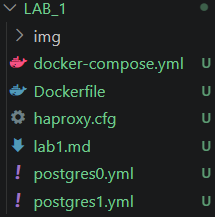
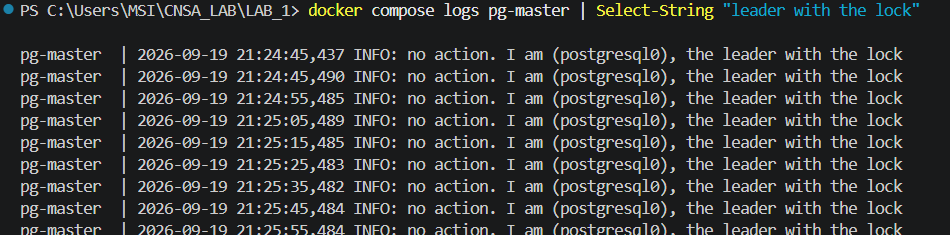
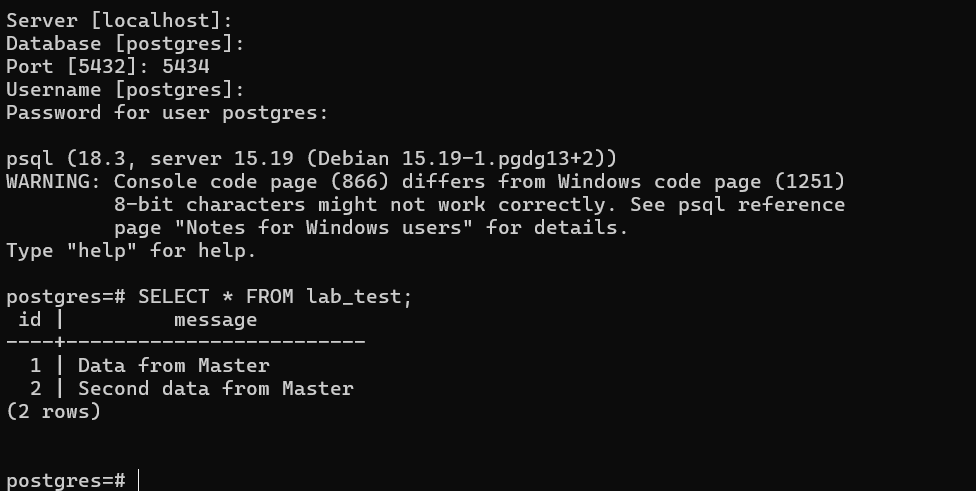
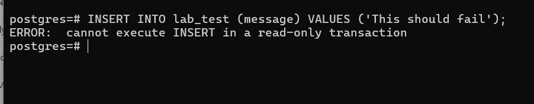
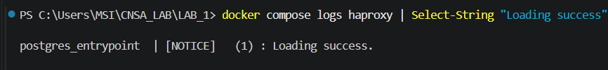
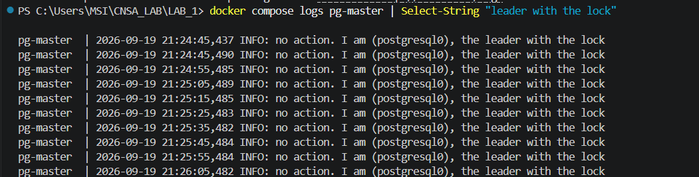
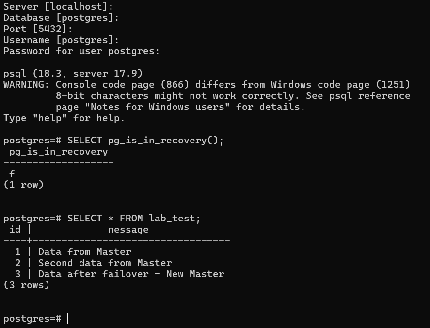
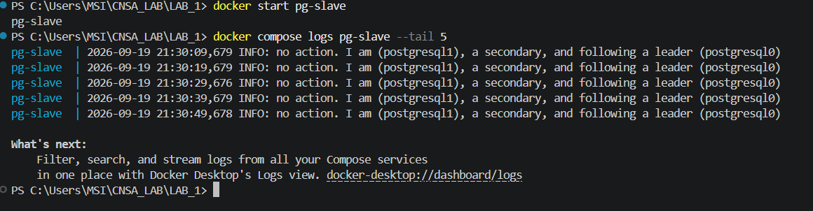

# Отчет по лабораторной работе №3

## Высокодоступный кластер PostgreSQL (Patroni + Zookeeper + HAProxy)

| | |
|---|---|
| **Выполнил** | [Ваше Имя] |
| **Дата** | 20 сентября 2026 г. |

---

## СОДЕРЖАНИЕ

1. [Цель работы](#1-цель-работы)
2. [Структура проекта](#2-структура-проекта)
3. [Ход выполнения работы](#3-ход-выполнения-работы)
   - [Часть 1. Развертывание кластера PostgreSQL + Patroni](#часть-1-развертывание-кластера-postgresql--patroni)
   - [Часть 2. Проверка репликации](#часть-2-проверка-репликации)
   - [Часть 3. Настройка высокой доступности (HAProxy)](#часть-3-настройка-высокой-доступности-haproxy)
4. [Выполнение основного задания (Failover Test)](#4-выполнение-основного-задания-failover-test)
5. [Заключение](#5-заключение)

---

## 1 Цель работы

Развернуть и настроить высокодоступный кластер PostgreSQL с использованием Patroni, Zookeeper и HAProxy. Проверить механизмы репликации, автоматического переключения при отказе (failover) и восстановления узлов.

---

## 2 Структура проекта

Для реализации лабораторной работы был создан следующий набор конфигурационных файлов:

> 

*Рисунок 1 − Структура папки проекта*

Основные компоненты проекта приведены в таблице 1.

Таблица 1 – Основные компоненты проекта

| Файл | Назначение |
|---|---|
| `Dockerfile` | Кастомный образ на базе `postgres:15` с установленным Patroni и зависимостями для Zookeeper |
| `docker-compose.yml` | Описание сервисов кластера: `pg-master`, `pg-slave`, `zoo`, `haproxy` |
| `postgres0.yml` / `postgres1.yml` | Конфигурации узлов Patroni с уникальными именами, адресами и путями к данным |
| `haproxy.cfg` | Конфигурация балансировщика нагрузки для маршрутизации трафика к активному мастеру |

---

## 3 Ход выполнения работы

### Часть 1. Развертывание кластера PostgreSQL + Patroni

Был собран кастомный Docker-образ и запущен стек сервисов командой:

```bash
docker compose up -d --build
```

В логах подтверждено успешное подключение к Zookeeper и выбор лидера кластера.

> 

*Рисунок 2 − Логи запуска кластера*

Как видно из логов, узел `postgresql0` (контейнер `pg-master`) успешно стал лидером, а `postgresql1` (контейнер `pg-slave`) подключился как вторичный узел.

### Часть 2. Проверка репликации

Для проверки синхронизации данных были выполнены следующие действия.

**1. Подключение к мастеру (порт 5433) и создание тестовой таблицы:**

```sql
CREATE TABLE lab_test (id SERIAL PRIMARY KEY, message TEXT);
INSERT INTO lab_test (message) VALUES ('Hello from master');
```

**2. Подключение к слейву (порт 5434) и проверка наличия данных:**

>

*Рисунок 3 − Результат запроса `SELECT * FROM lab_test;` на порту 5434*

Данные успешно реплицировались на вторичный узел. При попытке записи на слейв была получена ожидаемая ошибка режима «только чтение»:

> 

*Рисунок 4 − Ошибка записи на слейве (порт 5434)*

### Часть 3. Настройка высокой доступности (HAProxy)

В состав стека был добавлен сервис HAProxy, слушающий порт 5432. Балансировщик настроен на проверку состояния узлов через REST API Patroni (порт 8008).

> 

*Рисунок 5 − Панель статистики HAProxy (порт 7000)*

Подключение через единую точку входа (`localhost:5432`) успешно перенаправляется на текущего лидера кластера.

---

## 4 Выполнение основного задания (Failover Test)

В соответствии с заданием было проведено тестирование отказоустойчивости путем принудительного отключения текущей мастер-ноды.

### Шаг 1. Принудительная остановка мастера

Текущим лидером являлся контейнер `pg-slave` (`postgresql1`). Он был остановлен командой:

```bash
docker stop pg-slave
```

### Шаг 2. Автоматическое переключение (Failover)

После остановки лидера Patroni на оставшемся узле (`pg-master`) обнаружил потерю блокировки в Zookeeper и автоматически повысил себя до роли лидера.

> 

*Рисунок 6 − Логи `pg-master` после failover*

### Шаг 3. Проверка работоспособности через HAProxy

Несмотря на отказ основной ноды, подключение через HAProxy (порт 5432) осталось доступным. Была выполнена запись новых данных, что подтверждает успешную работу нового мастера.

> 

*Рисунок 7 − Результат запроса `SELECT * FROM lab_test;` через порт 5432 после failover*

### Шаг 4. Восстановление кластера (Auto-Recovery)

Остановленный узел был запущен повторно:

```bash
docker start pg-slave
```

После запуска узел автоматически определил текущего лидера и присоединился к кластеру в качестве реплики, начав синхронизацию недостающих данных.

> 

*Рисунок 8 − Логи `pg-slave` после восстановления*

---

## 5 Заключение

В ходе лабораторной работы был успешно развернут высокодоступный кластер PostgreSQL. Протестированы ключевые механизмы HA:

- синхронная репликация данных между узлами;
- защита слейвов от операций записи;
- автоматический failover при отказе мастера без потери доступности для клиентов (через HAProxy);
- автоматическое восстановление и ресинхронизация вернувшегося в строй узла.

Все требования лабораторной работы выполнены, кластер функционирует в штатном режиме.